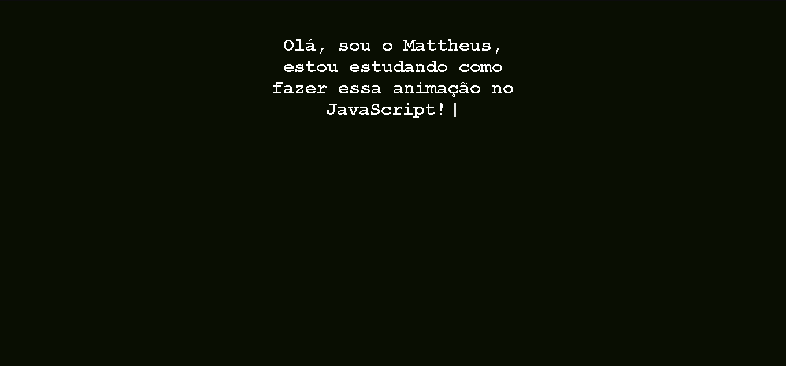

# Animação Typewriter no JavaScript

Este repositório contém um exemplo de animação Typewriter implementada em JavaScript. A animação Typewriter simula o efeito de uma máquina de escrever digitando texto gradualmente na tela.

## Funcionamento

A animação Typewriter é desenvolvida em JavaScript puro, sem a necessidade de bibliotecas externas. O código utiliza eventos, manipulação do DOM e temporizadores para criar o efeito de digitação gradual do texto.

## Pré-requisitos

- Navegador web moderno com suporte a JavaScript.

## Instruções

1. Faça o download ou clone este repositório.
2. Abra o arquivo `index.html` em um navegador.
3. A página será exibida com uma área em branco.
4. A animação Typewriter iniciará automaticamente, mostrando o texto gradualmente.

## Personalização

No arquivo `index.html e script.js`, você pode editar o projeto;

## Contato ✉️

- E-mail: mattheusp382@gmail.com
- LinkedIn: [Mattheus-Pereira](https://www.linkedin.com/in/mattheuspereira/)
- Instagram - https://www.instagram.com/mattheusp_dev/
- Portfólio: [mattheus-portoflio.com](https://mattheusp-portfolio.vercel.app/?vercelToolbarCode=q89Jf0X1nPzxRLO)

## Licença ⚖️

Este projeto está licenciado sob a Licença MIT(https://opensource.org/licenses/MIT) - consulte o arquivo [LICENSE.md](LICENSE.md) para obter mais detalhes.